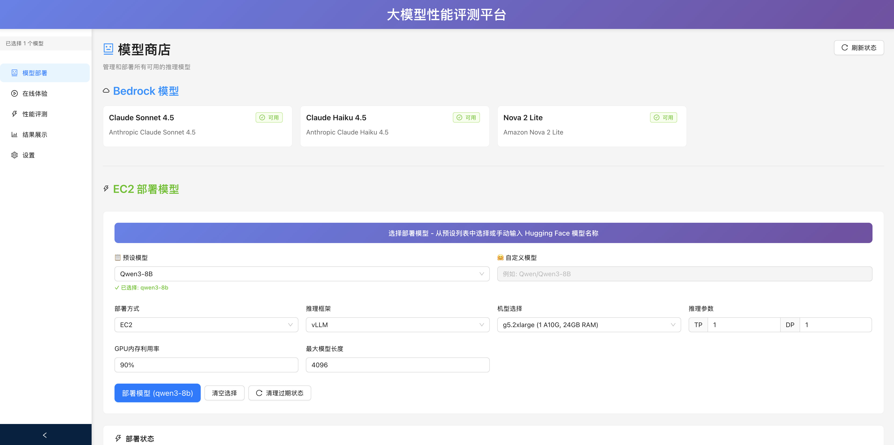
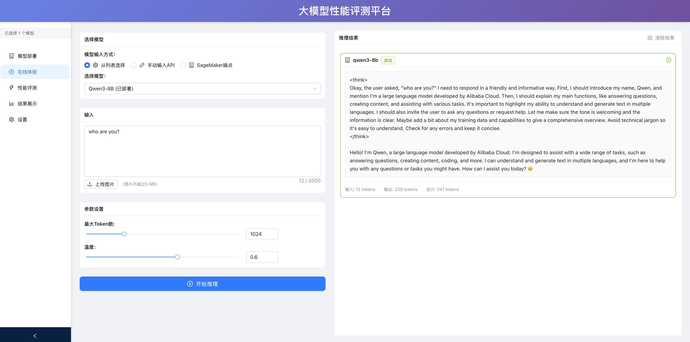
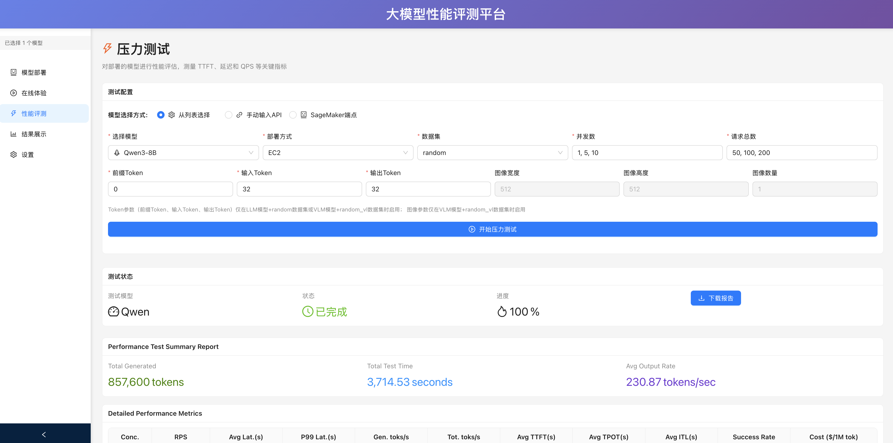
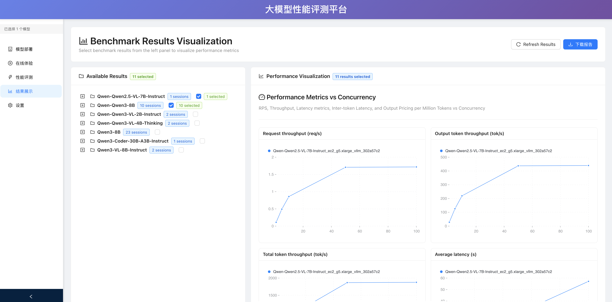

# Model Performance Evaluation Platform

A comprehensive platform for model (LLMs, VLMs, etc.) deployment and performance evaluation. Supports 1-click deployment of various models on EC2 using vLLM, SGLang, plus comprehensive performance testing and visualization.

## 📖 Platform Overview

The platform contains the following 4 core modules.

### 1. Model Deployment (模型部署)
- Deploy models to AWS infrastructure (EC2)
- Support for multiple instance types (g5.xlarge, g6e.xlarge, etc.) and inference engines (vllm, sglang)
- Real-time deployment status monitoring



### 2. Interactive Playground (在线体验)
- Test the connectivity to the deployed model
- Multimodal input support (text, images)
- Real-time response generation (to come)



### 3. Performance Testing (性能评测)
- Stress testing with configurable parameters
- Support random/random_vl datasets, some open datasets and custom dataset, for custom dataset, prepare it using jsonl format with each line having at least the prompt keyword: {"prompt": "Tell me a joke."}
- Throughput and latency benchmarking
- Concurrent request simulation
- Performance metrics collection



### 4. Result Visualization (结果展示)
- Performance charts and analytics
- Model comparison dashboards
- Historical trend analysis
- Export capabilities




## 🚀 Quick Start

### Prerequisites

- Python 3.10+ (Required)
- Node.js 16+ 
- AWS credentials configured

### Automated Setup (Recommended)

```bash
# Automatic setup and service start. 
./start.sh
```

If the environments are not configured, it will automatically install backend and frontend packages, then start the service. If the environments are already setup, it will directly start the service. The output of the command is

```
🌐 Platform is starting up...  
🖥️  Frontend: http://localhost:3000  
📊 Backend: http://localhost:5000  
📚 API Docs: http://localhost:5000/docs
```

Then open the frontend url in your browser would see the platform.

If you need to update the environments, you can run setup first `./setup.sh`, then run `./start.sh`

### Manual Setup

**1. Backend Environment**

```bash
# Create Python environment
cd backend

uv venv --python 3.10
source .venv/bin/activate
uv pip install --upgrade pip
uv pip install -r requirements.txt

# Configure AWS credentials
aws configure
# OR set environment variables:
export AWS_ACCESS_KEY_ID=your_key
export AWS_SECRET_ACCESS_KEY=your_secret
export AWS_SESSION_TOKEN=your_token  # if using temporary credentials
```

**2. Frontend Environment**

First, please install node js using the following commands in Linux. In other systems, please follow https://nodejs.org/en/download/ to install.

```bash
# Download and install nvm:
curl -o- https://raw.githubusercontent.com/nvm-sh/nvm/v0.40.3/install.sh | bash

# in lieu of restarting the shell
\. "$HOME/.nvm/nvm.sh"

# Download and install Node.js:
nvm install 24

# Verify the Node.js version:
node -v # Should print "v24.11.1".

# Verify npm version:
npm -v # Should print "11.6.2".
```

```bash
# Install Node.js dependencies
cd frontend
npm install
```

**3. Start the Platform**

```bash
# Terminal 1: Start backend (from project root)
python run_backend.py

# Terminal 2: Start frontend (from project root)
cd frontend && npm start
```

**4. Access the Application**

- **Frontend**: http://localhost:3000
- **Backend API**: http://localhost:5000
- **Health Check**: http://localhost:5000/health

Similarly, open the frontend url in your browser would see the platform.

### System Requirements

1. To deploy an model in the same instance, then select the appropriate EC2 instance based on the model, for instance, to deploy Qwen3-8B, select an instance with GPU memory >= 24 GB, like g5.xlarge.

2. If only use the platform for test, models are deployed elsewhere, then the following requirements are enough, e.g., m5.2xlarge.

- **Minimum**: 8GB RAM, 4 CPU cores
- **Recommended**: 16GB RAM, 8 CPU cores
- **Storage**: 50GB free space for model deployments
- **Network**: Stable internet for AWS API calls

## 📋 TODOs
- [ ] Streaming Output in Playground Page
- [ ] Support of SageMaker Endpoint VLM models
- [ ] Support of evaluations of LLM/VLM models on various benchmarks

## 🔒 Security Best Practices

- Store AWS credentials in environment variables or AWS credentials file
- Use IAM roles with minimum required permissions
- Enable VPC security groups for deployed models
- Implement rate limiting for production deployments
- Regular security updates for all dependencies

## 🤝 Contributing

1. Fork the repository
2. Create a feature branch (`git checkout -b feature/amazing-feature`)
3. Follow the existing code style and architecture patterns
4. Add tests for new functionality
5. Ensure all tests pass (`python tests/test_new_system.py`)
6. Submit a pull request with detailed description

## 📄 License

This project is licensed under the MIT License - see the LICENSE file for details.

## 📞 Support

**For Technical Issues:**
- Check the troubleshooting section above
- Review logs in `logs/backend.log`, `logs/frontend.log`, `backend/logs/development.log`
- Test system health with provided test scripts

**For Feature Requests:**
- Open an issue with detailed requirements
- Include use cases and expected behavior

## 🙏 Acknowledgment

We reused the codes from [evalscope](https://github.com/modelscope/evalscope) for stress testing.