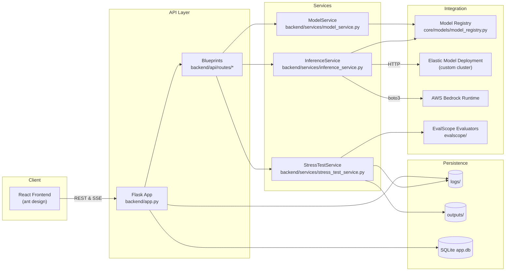

# Performance Evaluation Platform Architecture

## 1. High-Level Overview
The performance evaluation platform combines a Flask-based backend, an Ant Design React frontend, and optional benchmarking utilities (EvalScope) to orchestrate large language model (LLM/VLM) inference and stress testing. Configuration files under `config/environments/` drive runtime behaviour, allowing operators to switch between development and production without code changes. The system supports:

- Multi-model inference (AWS Bedrock and on-prem Elastic Model Deployment services)
- Real-time streaming of incremental outputs via Server-Sent Events
- Stress test orchestration with background workers and log-driven progress tracking
- Evaluation workflows that leverage the `evalscope` package for dataset-level benchmarking
- Flexible storage/logging pipelines that retain generated artefacts and operational metrics

## 2. System Context Diagram


## 3. Backend Architecture
- **Application Factory (`backend/app.py`)** – Builds the Flask app, loads configuration via `backend/config/config_manager.py`, configures logging/CORS, and registers blueprints under `/api/v1`.
- **Blueprints (`backend/api/routes/`)** – Grouped by domain:
  - `inference_routes.py` exposes `/multi-inference` with SSE streaming and `/inference` for single-model flows.
  - `model_routes.py` lists registered models, deployment statuses, and metadata for the frontend pickers.
  - `stress_test_routes.py` kicks off, monitors, and terminates stress-test sessions.
  - `results_routes.py` retrieves previously generated benchmark outputs stored under `outputs/`.
- **Services Layer**
  - `InferenceService` spins up threads per model, streams incremental JSON payloads, and supports manual API descriptors (`manual_config`) for non-registered targets.
  - `StressTestService` manages long-running subprocesses (benchmark runners), parses emitted logs for progress, and keeps an in-memory session cache with resumable metadata.
  - `ModelService` keeps registry data, synchronises EMD deployments, and surfaces Bedrock capabilities.
- **Utilities (`backend/utils/`)** – Shared logging helpers (`logging_config.py`), image preprocessing (base64 decoding, resizing), storage helpers (ETag naming, cleanup windows), and AWS helper snippets.

## 4. Configuration Strategy
- **Default Settings (`backend/config/settings.py`)** define server ports, log paths, AWS regions, and feature flags. Derived constants (e.g., `EMD_INSTANCE_TYPES`, `BEDROCK_REGIONS`) drive frontend dropdowns and validation rules.
- **Environment Overrides (`config/environments/*.yaml`)** allow environment-specific adjustments, e.g. enabling Flask debug mode in `development.yaml`.
- **Runtime Resolution** loads `config.json` from `config/` via `ConfigManager`, merging defaults and overrides, then exposes a dictionary-style API (`config.get('logging.level')`).
- **Secrets** should be injected through environment variables (e.g., `SECRET_KEY`, Bedrock credentials); the repository avoids committing credentials.

## 5. Frontend Workflow
- **Application Entry (`frontend/src/App.js`)** coordinates routing between major pages using React Router.
- **Key Pages**
  - `ModelSelectionPage` – fetches `GET /api/models`, supports filtering by provider/type, and stores selections in context/state.
  - `InferencePage` – posts to `/api/multi-inference` using `fetch` + `ReadableStream`, accumulates streaming chunks, and presents them via `ResultsDisplay` cards.
  - `StressTestPage` – builds scenario matrices (concurrency, token sizes), calls `/api/stress-test/start`, and polls `/api/stress-test/status`. Includes AWS cost heuristics based on instance types.
  - `VisualizationPage` – renders `outputs/` artefacts (CSV/JSON) with Ant Design charts.
  - `MaterialUploadPage` – handles dataset ingest, converting image/video files to base64 for the backend.
- **State Persistence** – Session metadata (active stress tests, selected models) is cached in `localStorage`, enabling reload-safe experiences.

## 6. Benchmarking & EvalScope Integration
- The `evalscope/` package (vendored under the repo) provides dataset runners, scoring heuristics, and reporting utilities.
- Stress tests or evaluation jobs can spawn EvalScope commands; outputs are written under `logs/` and `outputs/benchmark_*` for visualisation.
- `tests/` within EvalScope cover dataset loaders, metrics, and CLI wrappers—useful references when extending evaluation scenarios.

## 7. Persistence and Artefact Management
- **SQLite (`data/app.db`)** stores lightweight metadata (e.g., stress test sessions, cached results). Toggle `database.echo` to debug SQL.
- **Logs (`logs/`)** capture application and benchmark logs. `setup_logging` configures rotating file handlers with user-specified levels.
- **Outputs (`outputs/`)** houses CSV/JSON/HTML artefacts from inference/stress pipelines. Cleanup policies are driven by `storage.cleanup_days`.
- **Static Assets (`frontend/public/`)** supply UI icons, dataset examples, and doc links.

## 8. Operational Considerations
- **Deployment** – Use `scripts/start.sh` to bootstrap both backend (Gunicorn) and frontend (React dev server). Containerisation should treat backend and frontend as separate services but share configuration volumes.
- **Credentials** – Bedrock calls require boto3-compatible credentials; EMD endpoints assume intra-VPC access or pre-configured API gateways.
- **Scaling** – Increase Gunicorn workers and stress-test concurrency thresholds for production; adjust `benchmarking.max_concurrent` to avoid overloading GPU clusters.
- **Monitoring** – Extend `logging_config` to push metrics to CloudWatch or Grafana; integrate Prometheus exporters for inference latency and error rates.

## 9. Extensibility Checklist
1. Add new models to `core/models/model_registry.py` and expose them via the registry API.
2. Implement new service methods in `backend/services/` and wire routes in `backend/api/routes/`.
3. Update frontend pages/components to surface new capabilities (e.g., novel eval metrics).
4. Extend EvalScope plugins for additional datasets or scoring functions.
5. Document API changes in `docs/API.md` and update automated tests.

## 10. Quick Verification Commands
```bash
# Run backend with live reload
ENVIRONMENT=development poetry run python run_backend.py

# Start frontend dev server
cd frontend && npm install && npm start

# Execute backend unit tests
pytest backend/tests  # adjust to target directories

# Launch a sample multi-model inference
curl -X POST http://localhost:5000/api/v1/multi-inference \
  -H 'Content-Type: application/json' \
  -d '{"models": ["claude35"], "text": "hello"}'
```
